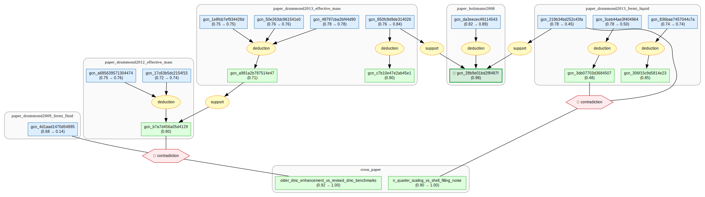

# 2D HEG Effective Mass Gaia



This document is a compact narrative view of the rendered Gaia graph. It follows
two open questions about the quasiparticle effective mass of the ideal
two-dimensional homogeneous electron gas / uniform electron liquid:

> Does the apparent paramagnetic low-density 2D HEG mass enhancement in earlier
> DMC survive the later high-precision finite-size extrapolation protocol?
>
> How should the 2013 Drummond-Needs extrapolation protocol be reconciled with
> the 2025 QMC treatment of Slater-Jastrow-backflow wave functions, band
> fitting, and finite-size extrapolation?

These questions are best read as two stages of one reconciliation chain. The
2013 Drummond-Needs benchmark first revises the older DMC enhancement
interpretation; the 2025 QMC branch then reopens how that 2013 benchmark should
be understood under newer finite-size, band-fitting, and backflow protocols.

## 1. Accepted Open Questions

The graph contains two accepted reconciliation questions. Both are intentionally
framed as weak, method-level scientific tensions rather than hard logical
conflicts.

### Older DMC enhancement vs revised DMC benchmarks

The first side says that earlier DMC calculations found a significant
paramagnetic effective-mass enhancement as density was lowered.

The second side says that the later Drummond-Needs high-precision DMC
benchmarks, with smaller statistical errors and explicit finite-size
extrapolation, give thermodynamic paramagnetic masses close to one:
`0.955(2)`, `1.04(2)`, and `1.03(4)` at `r_s=1,5,10`.

The open question is whether the older enhancement survives the later
finite-size/statistical treatment, or whether it is best understood as a
methodological revision of the earlier interpretation.

This is not a claim that the two papers describe incompatible physical laws. It
is a question about whether an apparent low-density mass-enhancement signal is
robust to a more careful finite-size extrapolation protocol.

### 2013 near-unity benchmark vs 2025 increasing trend

The first side says that the 2013 Drummond-Needs finite-size-extrapolated DMC
branch gives paramagnetic thermodynamic-limit masses close to one at
`r_s=1,5,10`.

The second side says that the 2025 Azadi-Drummond-Principi-Belosludov-Bahramy
QMC branch finds a paramagnetic 2D-UEL mass close to one at `r_s=1` but
increasing over `1 <= r_s <= 5`.

The open question is how to reconcile the two protocols: system sizes,
Slater-Jastrow-backflow treatment, band fitting, and finite-size extrapolation
must be compared before the low-density trend can be called settled.

This is the current-literature stage of the same chain. The 2025 branch does
not simply undo the 2013 benchmark; it asks whether the 2013 near-unity picture
is complete once newer QMC choices and larger finite-size analyses are included.

## 2. Finite-Size Root

The graph starts from the finite-size warning:

> **Slow finite-size errors can flip `m* - m`**

It states that finite-cell corrections to near-`k_F` excitation dispersion can
be slow enough that extrapolations assuming faster-vanishing errors may change
the inferred sign and magnitude of `m* - m`.

This is the reason the effective mass is not treated as a simple output number.
The ideal effective mass is a thermodynamic-limit Fermi-liquid quantity, but QMC
extracts it through finite-cell bands, fitting windows, and extrapolation
assumptions.

## 3. DMC Benchmark Side

The Drummond-Needs benchmark branch gives the graph's main near-unity side:

- finite-N DMC bands are computed from add/remove total-energy differences;
- the band is fitted around `k_F`;
- `m*(N)` is extracted from the fitted derivative;
- `m*(N)` is extrapolated to the thermodynamic limit;
- the resulting paramagnetic 2D HEG masses remain close to one for
  `r_s=1,5,10`.

This side explains why the 2013 branch weakens the older mass-enhancement
interpretation. It should not be read as the final current-literature verdict:
the 2025 QMC study reopens how the paramagnetic mass evolves with decreasing
density.

## 4. Protocol Fragility

The graph also records why the benchmark is not a trivial number:

- near-`k_F` numerical derivatives can be pathological;
- wide `k` windows stabilize band fits;
- excited-state wave-function reoptimization lowers finite-cell energies but
  increases finite-size bias;
- fixed-node and time-step biases must be judged relative to finite-size
  extrapolation uncertainty;
- DMC occupied bands are not purely quadratic, so `m*` is only one local
  projection of a richer quasiparticle dispersion.

This branch is the graph's main explanation of how finite-cell data can be
converted into a thermodynamic-limit effective mass without overreading
near-`k_F` artifacts.

## 5. 2025 QMC Update

The 2025 branch reopens the low-density trend inside modern QMC:

- a paramagnetic 2D-UEL trend in which `m*` increases with `r_s` over
  `1 <= r_s <= 5`;
- an empirical `N^(-3/2)` finite-size extrapolation protocol for that data;
- a ferromagnetic trend moving oppositely with density, clarifying the
  spin-sector dependence of the mass.

This branch does not simply invalidate the 2013 benchmark. It reframes the
current question: the modern literature now asks which QMC extraction protocol,
finite-size treatment, and trial-wave-function choices determine the
paramagnetic low-density trend.

The 2025 paper answers what happens under its own protocol. It does not, by
itself, fully close the reconciliation question, because a matched comparison
between the 2013 and 2025 protocols is still needed.

## 6. Fermi-Liquid-Parameter Caveat

The graph also includes a Fermi-liquid-parameter branch. It says that
`N^(-1/4)` finite-size scaling is physically motivated by long-range
correlation, while direct finite-cell extrapolation of Fermi-liquid parameters
can still be unreliable when shell-filling oscillations dominate the statistical
error bars.

This branch is a caveat, not one of the graph's accepted open questions. The
asymptotic scaling law and the practical shell-filling limitation can both be
true.

## 7. Graph-Level Meaning

The graph does not say simply "`m*/m` is above one" or "`m*/m` is below one."
It says:

> The ideal 2D HEG effective mass is a thermodynamic-limit Fermi-liquid
> quantity, but its finite-cell QMC extraction is highly protocol-sensitive.
> The 2013 benchmark first revises an older enhancement interpretation, and the
> 2025 QMC branch then asks whether that benchmark is complete under newer
> finite-size, band-fitting, and backflow treatments.

The graph therefore presents one chained scientific story: older DMC suggested
paramagnetic mass enhancement, 2013 high-precision extrapolation made the
benchmark near unity, and 2025 QMC reopened the low-density trend under a newer
protocol.

Hypothesis-only questions stored under `.gaia/inquiry` are not counted as final
graph open questions unless they are promoted to accepted reconciliation
questions.

## 8. Inference State

The rendered graph contains:

- 50 rendered science nodes.
- 46 starmap edges.
- 51 compiled knowledge entries.
- 18 strategy nodes.
- 2 accepted reconciliation questions.

The starmap filters out Gaia's internal `__conjunction_result_*` and
`__implication_result_*` helper nodes, so the visual graph is the
science-readable probability graph rather than a dump of lowering internals.

## Package Contents

- `src/twodheg_effective_mass/` — Gaia DSL claims, deductions, supports,
  reconciliation relations, and priors.
- `references.json` — bibliographic references used by the package.
- `artifacts/lkm-discovery/` — raw LKM payloads, retrieval timeline, graph
  growth log, and mapping audits.
- `.gaia/` — compiled Gaia artifacts, beliefs, inquiry state, and starmap
  outputs.

## Quality Gates

The current package state passes:

```bash
gaia compile .
gaia check --brief .
gaia check --hole .
gaia infer .
gaia inquiry review --strict .
```

## Repository Name

This repository is named `twodheg-effective-mass-gaia` so it does not begin with a digit.
